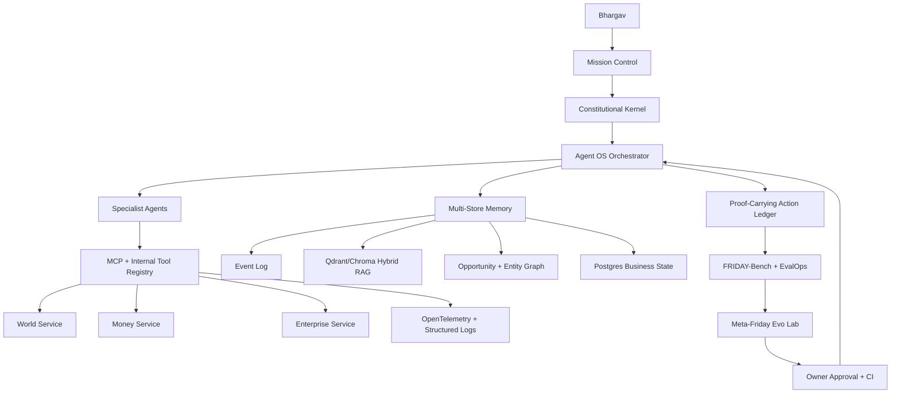

# FRIDAY/NEXUS Extensive R&D Memo

Generated: 2026-05-07

Owner: Bhargav

Purpose: Extend the FRIDAY/NEXUS vision beyond the PDF and current repository into a research-backed, buildable architecture for a self-evolving, world-aware, money-hunting Agentic OS.

## Executive Synthesis

The PDF and conversation logs correctly identify the big pieces: internal APIs, agent OS, specialist agents, model/RAG stack, policy tiers, and Meta-Friday. The missing layer is the operating science that makes those pieces compound instead of becoming a pile of agents.

FRIDAY should not be built as "one more chatbot with tools." It should be built as an intelligence operating system with:

1. A nervous system: every event, observation, tool call, approval, result, and failure becomes structured state.
2. A constitutional kernel: every action passes a policy preflight before execution.
3. Proof-carrying actions: every agent output must include evidence, risk tier, rollback path, and post-action measurement.
4. An opportunity graph: money opportunities are modeled as testable hypotheses, not motivational ideas.
5. A memory sleep cycle: daily consolidation converts logs into facts, preferences, playbooks, and benchmark tasks.
6. A self-improvement lab: Meta-Friday proposes patches and experiments, but cannot self-deploy without tests and Bhargav approval.

The core design shift: FRIDAY must become an empirical machine. Every claim, plan, outreach sequence, code change, trade idea, content idea, and business action should be treated as an experiment with evidence, expected value, risk, and measurable outcomes.

## Research Anchors

These are the research and platform signals that should shape FRIDAY/NEXUS.

### Agentic Discovery And Self-Improvement

- Sakana's AI Scientist showed an agent pipeline for idea generation, experiment execution, paper writing, and review. The later AI Scientist-v2 direction emphasizes stronger automated experimentation and end-to-end scientific discovery. This supports building Meta-Friday as an experiment lab, not as a vague self-improvement loop. Sources: [AI Scientist](https://sakana.ai/ai-scientist/), [AI Scientist paper](https://arxiv.org/abs/2408.06292), [AI Scientist-v2 paper](https://arxiv.org/abs/2504.08066).
- DeepMind's AlphaEvolve uses Gemini to discover and improve algorithms through an evolutionary coding loop. The lesson for FRIDAY: improvement should happen through candidate generation, evaluation, selection, and deployment gates. Source: [AlphaEvolve](https://deepmind.google/discover/blog/alphaevolve-a-gemini-powered-coding-agent-for-designing-advanced-algorithms/).
- Darwin Godel Machine explores self-improving coding agents that modify their own codebase while preserving a history of versions. FRIDAY should borrow the versioned archive idea, but keep human approval and CI as hard gates. Source: [Darwin Godel Machine](https://arxiv.org/abs/2505.22954).
- SWE-agent demonstrates that the agent-computer interface matters as much as the model for repository-level software work. FRIDAY's Builder Mode should expose compact, purpose-built tools instead of dumping raw terminal chaos into prompts. Source: [SWE-agent](https://arxiv.org/abs/2405.15793).
- AgentGym frames agent learning around diverse environments, trajectories, benchmarks, and evolution methods. FRIDAY should use simulated environments and FRIDAY-Bench before attempting live autonomy. Source: [AgentGym](https://arxiv.org/abs/2406.04151).
- Voyager demonstrates lifelong skill acquisition, a skill library, and automatic curriculum learning in an open-ended environment. FRIDAY should learn reusable procedures from successful actions and store them as playbooks. Source: [Voyager](https://arxiv.org/abs/2305.16291).
- Reflexion shows that language agents can improve through verbal feedback over trials. FRIDAY's reflector should generate structured "what failed, why, next test" notes after every important run. Source: [Reflexion](https://arxiv.org/abs/2303.11366).
- Generative Agents showed the value of memory streams, reflection, and planning for believable long-running behavior. FRIDAY needs memory beyond chat transcripts: observations, reflections, goals, and plans. Source: [Generative Agents](https://arxiv.org/abs/2304.03442).

### Production Agent Infrastructure

- OpenAI's current platform direction centers on Responses, tools, background mode, hosted tool use, and the Agents SDK. For FRIDAY, OpenAI should be used where high reasoning quality, coding quality, and tool orchestration matter. Sources: [OpenAI Agents guide](https://platform.openai.com/docs/guides/agents), [Responses API](https://platform.openai.com/docs/api-reference/responses), [OpenAI Agents SDK](https://openai.github.io/openai-agents-python/).
- Model Context Protocol standardizes the host/client/server shape for connecting AI systems to tools and data. FRIDAY should use MCP as a long-term tool boundary while keeping critical local tools deterministic and available even when MCP startup fails. Source: [MCP architecture](https://modelcontextprotocol.io/docs/learn/architecture).
- LangGraph persistence and human-in-the-loop interrupts are relevant for durable agent workflows with approvals. FRIDAY's bigger workflows should be resumable, inspectable, and interruptible. Sources: [LangGraph persistence](https://langchain-ai.github.io/langgraph/concepts/persistence/), [LangGraph human-in-the-loop](https://langchain-ai.github.io/langgraph/concepts/human_in_the_loop/).
- OpenTelemetry's generative AI semantic conventions are a useful standard for tracing model calls, tool calls, costs, latency, prompts, and outputs. FRIDAY needs this because debugging agents without traces becomes impossible. Source: [OpenTelemetry GenAI conventions](https://opentelemetry.io/docs/specs/semconv/gen-ai/).

### Memory, RAG, And World Models

- Qdrant supports hybrid dense+sparse retrieval and query fusion, which is useful for mixing semantic recall with exact business/entity terms. Source: [Qdrant hybrid queries](https://qdrant.tech/documentation/concepts/hybrid-queries/).
- Microsoft GraphRAG shows how graph-based indexes can support global and local reasoning over large corpora. FRIDAY should use a graph layer for people, businesses, projects, topics, assets, and opportunities. Source: [Microsoft GraphRAG](https://www.microsoft.com/en-us/research/project/graphrag/).
- vLLM and SGLang both support OpenAI-compatible serving patterns for self-hosted models. This supports a model-router layer where local/open-source models handle cheap, private, low-risk work and cloud models handle high-value reasoning. Sources: [vLLM OpenAI-compatible server](https://docs.vllm.ai/en/latest/serving/openai_compatible_server.html), [SGLang OpenAI-compatible API](https://docs.sglang.ai/basic_usage/openai_api_completions.html).

### Governance, Security, And India Finance Constraints

- NIST AI RMF gives a practical govern/map/measure/manage frame for AI risk. FRIDAY's constitution should be encoded as measurable checks, not just a document. Source: [NIST AI RMF](https://www.nist.gov/itl/ai-risk-management-framework).
- OWASP's LLM Top 10 highlights prompt injection, sensitive information disclosure, excessive agency, supply chain risk, and other failure modes directly relevant to FRIDAY. Source: [OWASP Top 10 for LLM Applications](https://genai.owasp.org/llm-top-10/).
- India's Account Aggregator ecosystem is consent-based. RBI's framework and Setu's AA docs imply FRIDAY must never bypass consent, store credentials insecurely, or treat financial data as free-form scrapeable text. Sources: [RBI AA press release](https://www.rbi.org.in/Scripts/BS_PressReleaseDisplay.aspx?prid=39162), [RBI NBFC-AA directions](https://www.rbi.org.in/Scripts/BS_ViewMasDirections.aspx?id=10598), [Setu AA overview](https://docs.setu.co/data/account-aggregator/overview).
- RBI digital lending guidelines emphasize consent, transparency, data minimization, and regulated flows. FRIDAY's money-service should inherit these principles even for internal analytics. Source: [RBI Digital Lending Guidelines](https://www.rbi.org.in/SCRIPTS/BS_CircularIndexDisplay.aspx?Id=12382).
- SEBI's 2025 retail algorithmic trading framework reinforces that trading automation needs registration/controls, risk gates, and traceability. FRIDAY should keep trading autonomous execution out of scope until compliance and broker controls are explicit. Source: [SEBI retail algo circular](https://www.sebi.gov.in/legal/circulars/feb-2025/safer-participation-of-retail-investors-in-algorithmic-trading_91614.html).

## What The PDF Missed

### 1. Endpoint Lists Are Not Intelligence

The PDF lists APIs: news, weather, markets, maps, payments, email, calendar, tools. That is necessary but not sufficient. FRIDAY needs an event model that turns raw API responses into durable, comparable world state.

Required abstraction:

```text
source api -> raw observation -> normalized event -> entity links -> confidence -> freshness -> action relevance
```

Without this, FRIDAY will know facts but not understand what changed, why it matters, or what action it implies.

### 2. Money Needs Experiment Design, Not Motivation

"Make money" is not a task. It is a portfolio of constrained experiments. Every opportunity should be modeled as:

```text
hypothesis + evidence + expected value + owner time cost + cash risk + platform risk + legal risk + first reversible action + kill condition
```

FRIDAY should become an opportunity scientist. It should not simply search for gigs and draft posts. It should run a disciplined revenue lab.

### 3. Self-Evolution Must Be Evals-First

Self-modifying systems are dangerous when they optimize vibes. Meta-Friday should only optimize against benchmarks, traces, and real outcome metrics.

The improvement loop:

```text
logs -> failure clusters -> hypothesis -> patch/procedure -> FRIDAY-Bench -> regression tests -> owner approval -> deploy -> monitor
```

### 4. Memory Must Be Multi-Store

A vector database alone is not memory. FRIDAY needs:

- Event log for chronological truth.
- Relational tables for money, leads, invoices, approvals, and action state.
- Vector memory for semantic recall.
- Graph memory for people, companies, projects, skills, tools, and opportunities.
- File/artifact memory for reports, drafts, code, screenshots, and proofs.
- Consolidated playbooks for repeatable procedures.

### 5. The Owner Needs A State Model

FRIDAY should model Bhargav's context: goals, constraints, time windows, finances, skills, preferences, energy patterns, current projects, and risk appetite. This is not surveillance. It is an explicit owner-state model that Bhargav can inspect and correct.

### 6. Autonomy Needs Action Envelopes

Every tool action should carry a required action envelope:

```yaml
goal: string
action_type: string
risk_tier: 1|2|3|4
policy_decision: allow|queue|deny
evidence: list
inputs_redacted: object
expected_outcome: string
rollback: string
notification: none|summary|immediate
post_action_metric: string
trace_id: string
```

If an action has no envelope, it should not run.

## Groundbreaking But Buildable FRIDAY/NEXUS Modules

### 1. FRIDAY Nervous System

The nervous system is the event backbone. It records everything FRIDAY sees and does.

Core idea:

```text
ObservationEvent, ThoughtEvent, ToolCallEvent, ApprovalEvent, MoneyEvent, WorldEvent, CodeChangeEvent, MemoryEvent
```

Build target:

- Local-first event log now: JSONL or SQLite.
- Postgres event store later.
- Every event gets `source`, `timestamp`, `confidence`, `sensitivity`, `owner_visible`, and `trace_id`.
- Mission Control reads the event stream before acting.

Why it matters: this turns FRIDAY from a reactive assistant into a persistent organism with a memory of cause and effect.

### 2. World Twin

The World Twin is not "news search." It is a normalized model of external reality relevant to Bhargav.

Entities:

- Markets.
- AI tools.
- Local businesses.
- Leads.
- Competitors.
- Regulations.
- Weather/location context.
- Platforms like YouTube, WhatsApp, Google, GitHub, and payment rails.

Each entity has:

```text
latest_state, trend, source citations, confidence, freshness, business relevance, next possible action
```

First experiment:

- Build `world_events.jsonl`.
- Add a daily `world pulse`.
- Convert five news/search items into entity-linked events.
- Require citations and freshness checks.

### 3. Opportunity Graph

The Opportunity Graph is FRIDAY's money brain.

Nodes:

- Bhargav skills.
- Existing assets.
- Businesses.
- Leads.
- Niches.
- Content topics.
- Automation templates.
- Market demands.
- APIs/tools.
- Distribution channels.
- Offers.

Edges:

- "can sell to"
- "requires"
- "has proof"
- "has demand"
- "competes with"
- "can automate"
- "has platform risk"
- "can compound"

Scoring:

```text
OpportunityScore =
  expected_income
  * probability_of_close
  * speed_to_first_cash
  * compounding_potential
  / (owner_time_cost + cash_cost + legal_risk + platform_risk + execution_complexity)
```

FRIDAY should rank opportunities by expected learning and expected cash, not by hype.

### 4. Proof-Carrying Actions

FRIDAY should never say "done" without proof. Every action produces artifacts:

- Draft path.
- Sent message log.
- API response ID.
- Screenshot.
- Test report.
- Diff.
- Approval record.
- External citation.
- Metric delta.

This is the cure for hallucinated progress.

### 5. Constitutional Kernel

The constitution becomes executable policy.

Components:

- `policy.yaml`: owner rules, risk tiers, quiet hours, rate limits.
- `policy_engine`: preflight and postflight enforcement.
- `policy_tests`: constitutional CI.
- `policy_diff_review`: any constitution change requires explicit owner approval.

No agent, including Meta-Friday, should call external tools without this kernel.

### 6. Consent And Secret Firewall

FRIDAY needs a firewall between agent reasoning and sensitive material.

Rules:

- Secrets never enter prompts unless explicitly needed and redacted where possible.
- OTPs, passwords, recovery codes, private keys, and raw bank credentials are never stored in logs.
- AA financial data is tagged as sensitive and purpose-limited.
- Payment/trading actions require policy checks and audit trails.
- Prompt-injected instructions from web pages, emails, PDFs, or chats are treated as untrusted input.

This module should be built before live money APIs.

### 7. Memory Sleep Cycle

Every day, FRIDAY should run a "sleep" process:

```text
raw logs -> extract facts -> detect contradictions -> update graph -> update owner model -> update playbooks -> add benchmark cases -> archive raw artifacts
```

Outputs:

- `daily_memory_delta.md`
- `new_facts.json`
- `updated_playbooks/*.md`
- `bench_tasks_generated.json`
- `open_questions.md`

This turns experience into improvement.

### 8. Meta-Friday Evo Lab

Meta-Friday is a scientific improvement loop, not an uncontrolled self-editor.

Capabilities:

- Cluster failures from logs.
- Propose patches.
- Generate benchmark tasks.
- Run FRIDAY-Bench.
- Compare before/after metrics.
- Open a review packet for Bhargav.

Hard limits:

- No self-merge.
- No production deployment without tests.
- No secrets access.
- No policy weakening.
- No external money movement.

### 9. Revenue Reinforcement Loop

MoneyEngine should use a bandit-style loop:

```text
choose opportunity -> run smallest ethical action -> measure result -> update score -> exploit winners -> explore new variants
```

Example arms:

- WhatsApp automation demos for local businesses.
- Audit automation offers.
- Faceless AI content pipeline.
- Affiliate/content experiments.
- Micro-SaaS waitlist.
- Freelance automation gigs.
- Trading research only, not live autonomous execution.

Metrics:

- INR cash collected.
- Qualified replies.
- Meetings booked.
- Close rate.
- Owner time spent.
- Cost per lead.
- Time to first value.
- Repeatability.
- Legal/platform risk.

### 10. Agent Immune System

FRIDAY needs anomaly detection for itself.

Watch for:

- Sudden tool call spikes.
- Repeated failed external calls.
- Prompt injection patterns.
- Requests to reveal secrets.
- Cost spikes.
- New domains in outbound requests.
- Money or trading actions outside policy.
- Messages that impersonate Bhargav.

The immune system can pause autonomy and notify Bhargav.

### 11. Model Market Router

Instead of a fixed "local vs cloud" switch, FRIDAY should maintain model scorecards.

Route by:

- Task class.
- Risk tier.
- Required reasoning depth.
- Privacy level.
- Cost budget.
- Latency target.
- Eval performance.
- Context length.

Example:

- Local small model: summaries of non-sensitive logs, quick classifications, draft variations.
- OpenAI frontier model: architecture, code changes, hard planning, ambiguous decisions.
- Self-hosted vLLM/SGLang model: private RAG and high-volume low-risk work.
- Specialized open-source model: coding, math, finance research, only after eval.

### 12. Owner Digital Twin

This should not be a fake clone. It should be an inspectable decision context model:

```yaml
goals:
  near_term: []
  long_term: []
constraints:
  time_windows: []
  budget_limits: []
  risk_limits: []
preferences:
  communication_style: []
  business_biases: []
  learning_goals: []
current_state:
  focus: string
  energy: unknown|low|medium|high
  commitments: []
```

FRIDAY uses it to decide what to propose, when to interrupt, and what not to bother Bhargav with.

### 13. FRIDAY Flight Simulator

Before live autonomy, FRIDAY needs simulated worlds.

Simulators:

- Outreach simulator: fake leads and response probabilities.
- Money simulator: opportunity outcomes and cash/risk constraints.
- Email/calendar simulator.
- Trading simulator with historical data only.
- Tool failure simulator.
- Prompt injection simulator.

This lets Meta-Friday improve policies and plans without risking real money or reputation.

### 14. Mission Market Maker

FRIDAY should turn Bhargav's assets into offers.

Pipeline:

```text
skills/assets -> niche pain -> proof artifact -> offer -> lead list -> outreach -> demo -> proposal -> invoice -> delivery playbook
```

This is where "money-hunting" becomes concrete. The first high-probability path remains agency automation: local businesses that need WhatsApp/customer support/lead capture automation.

### 15. Knowledge Foundry

The Knowledge Foundry ingests papers, docs, repos, PDFs, and logs, then produces:

- Summaries.
- Implementation notes.
- Reusable snippets.
- Tool wrappers.
- Benchmarks.
- Playbooks.
- Risk notes.

It should never just "read the web." It must convert knowledge into capabilities.

## Proposed Long-Term Architecture



## New Capabilities To Add Beyond The Current 20

The existing 20 are strong. These should be added as second-order capabilities:

1. Event-sourced nervous system.
2. Executable constitutional kernel.
3. Proof-carrying action ledger.
4. Opportunity graph and money experiment engine.
5. Memory sleep cycle and contradiction resolver.
6. Agent immune system.
7. Model market router with eval scorecards.
8. Consent and secret firewall.
9. Flight simulator for autonomy.
10. Meta-Friday evolutionary lab.
11. Owner digital twin.
12. Knowledge foundry that turns sources into skills.

## P0 Experiments

These are the best next experiments because they improve all future work.

### Experiment 1: Action Envelope Everywhere

Goal: no skill/tool can execute without a standard envelope.

Build:

- `brain/action_envelope.py`
- `brain/policy.py` integration
- tests for low/medium/high/forbidden actions
- proof artifact generation

Success metric:

- 100 percent of mission-control actions log `risk_tier`, `policy_decision`, `trace_id`, and `proof_path`.

### Experiment 2: Opportunity Schema And Scorer

Goal: turn money ideas into ranked experiments.

Build:

- `skills/money_engine.py`
- `data/opportunities.jsonl`
- `data/money_experiments.jsonl`
- CLI: `friday opportunities`

Success metric:

- FRIDAY can rank at least 20 opportunities and generate the first reversible action for the top 3.

### Experiment 3: FRIDAY-Bench Minimum Viable Suite

Goal: stop self-improvement from being subjective.

Bench tasks:

- 3 money tasks.
- 3 research tasks.
- 3 code tasks.
- 3 personal assistant tasks.
- 3 safety/policy tasks.

Success metric:

- Every Meta-Friday proposal must pass baseline score and no-regression gates.

### Experiment 4: Memory Sleep Cycle

Goal: make logs become reusable intelligence.

Build:

- nightly summarizer
- fact extractor
- contradiction detector
- playbook updater
- benchmark generator

Success metric:

- Daily run produces a memory delta and at least one improved playbook or open question.

### Experiment 5: Agent Immune System

Goal: detect dangerous or abnormal autonomy behavior before it causes damage.

Build:

- tool-call anomaly detector
- secret/prompt-injection scanner
- money/trading policy sentinel
- autonomy pause switch

Success metric:

- Simulated prompt injection and secret exfiltration tests are blocked.

## P1 Product Roadmap

1. Make current FRIDAY v1 fully proof-logged.
2. Add opportunity graph and money experiment engine.
3. Add daily world pulse with entity-linked events.
4. Add memory sleep cycle.
5. Add minimal FRIDAY-Bench.
6. Add Meta-Friday proposal mode.
7. Add MCP registry for non-critical external tools.
8. Add consent/secret firewall before live Gmail, payment, AA, or brokerage integrations.
9. Add enterprise-service wrappers for Telegram, Gmail, Calendar, CRM, GitHub.
10. Add money-service sandbox only: AA sandbox, revenue APIs, payment gateway sandbox.
11. Add controlled live workflows: drafts, proposals, follow-ups, invoices, no irreversible money movement without approval.
12. Add voice/HUD only after proof/action/revenue loops are stable.

## Red Lines

FRIDAY should not autonomously:

- Move money.
- Place live trades.
- Send high-volume outreach.
- Sign contracts.
- Make legal, medical, or tax commitments.
- Bypass consent or platform terms.
- Store OTPs, passwords, raw bank credentials, or recovery codes.
- Weaken its own policy.
- Deploy its own code without CI and Bhargav approval.

## The Sharpest Vision Statement

FRIDAY is Bhargav's empirical operating intelligence: a local-first agentic OS that watches the world, understands the owner's mission, turns knowledge into money experiments, acts only through policy-gated tools, proves what it did, learns from every result, and improves itself through benchmarks and approved evolution.
